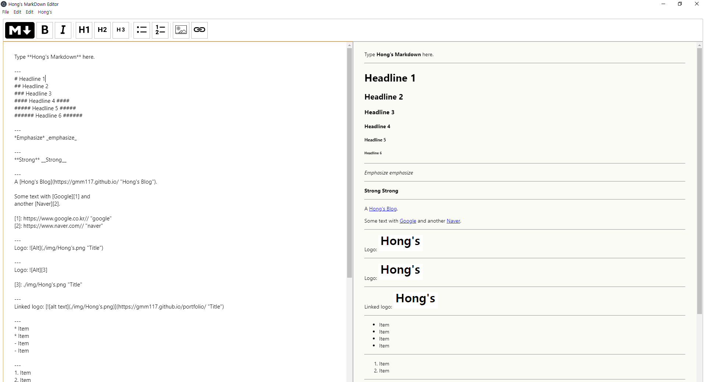

<p align="left"></a></p>

## Key Features

* Toolbar for basic Markdown formatting
* Full screen mode
  - Write distraction free.
* Cross platform
  - Windows, Mac, Linux
* Browser
  - IE11, Chrome, Safari, Edge

## How To Use

To clone and run this application, you'll need [Git](https://git-scm.com) and [Node.js](https://nodejs.org/en/download/) (which comes with [npm](http://npmjs.com)) installed on your computer. From your command line:

```bash
# Clone this repository
$ git clone https://github.com/gmm117/light-mkeditor.git

# Go into the repository
$ cd light-mkeditor

# Install dependencies
$ npm install

# webpack Run
$ npm run build

# webpack-dev-server Run
$ npm run dev

# webpack deploy
$ npm run deploy

# electron Run the app 
$ npm start
```


## Download

You can [download](https://github.com/gmm117/light-mkeditor) the latest installable version of light-mkeditor for Windows.

## Emailware

I'd like you send me an email at <gmm117@naver.com> about anything you'd want to say about this software. I'd really appreciate it!
## Credits

This software uses the following open source packages:

- [Electron](http://electron.atom.io/)
- [Node.js](https://nodejs.org/)
- [Marked - a markdown parser](https://github.com/chjj/marked)
- [webpack](https://webpack.js.org/)
- [babel](https://babeljs.io/)
- [npm](https://www.npmjs.com/)

## Support

## You may also like...

## CopyLight & License

Copyright (c) 2019 Hong SeungAh. main.js, util.js, index.js is released under the [MIT license](https://opensource.org/licenses/MIT).